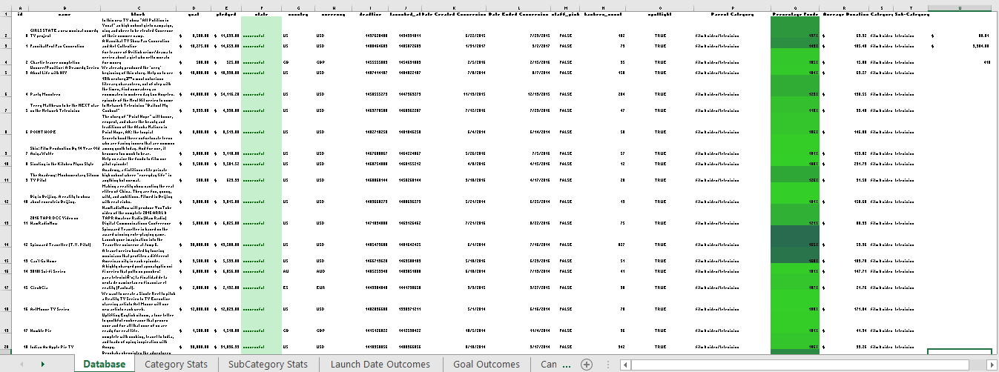
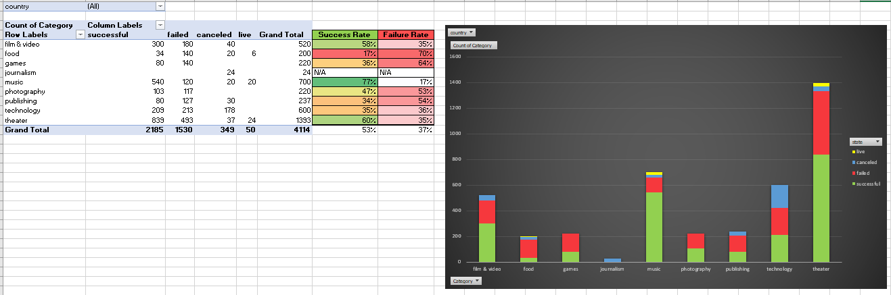
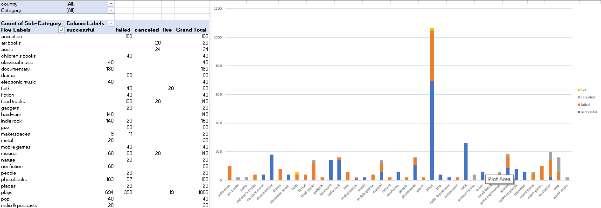
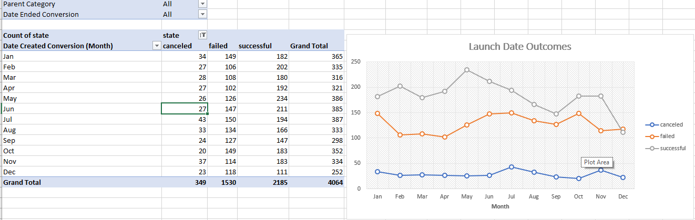
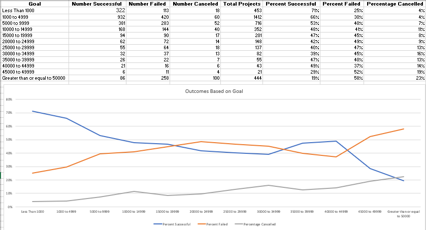
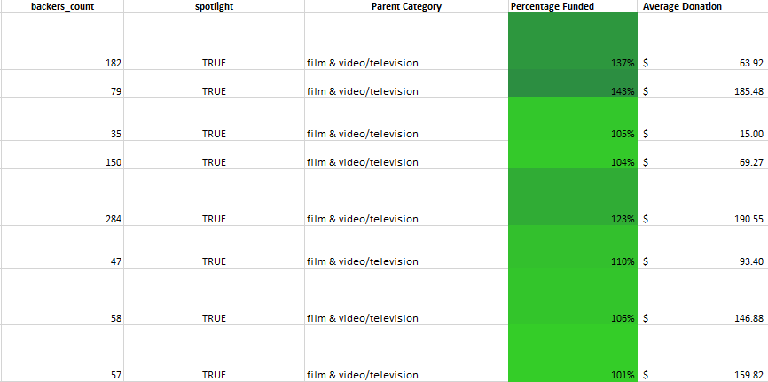

# Excel Kickstarter Project

## Problem Description

Focusing on creativity, over $2 billion has been recieved using the global crowdfunding platform, Kickstarter, to help bring creative projects to life. More than 15 million backers pledged funds to more than 300,000 projects. Only a third of campaigns have been successful.

Getting funded on Kickstarter requires meeting or exceeding the project's initial goal, so many organizations spend months looking through past projects in an attempt to discover some trick for finding success. Today we are left to organize and analyze a database of 4,000 past projects in order to uncover any hidden trends.

### Analysis Goal

Using the Excel table (StarterBook) provided, I modified and analyzed the data of 4,000 past Kickstarter projects in attempt to uncover some market trends.

- I use conditional formatting to fill each cell in the `state` column with a different color, depending on whether the associated campaign was successful, failed, or canceled, or is currently live.

- I created a new column O called `Percent Funded` that uses a formula to uncover how much money a campaign made to reach its initial goal.

  - I use conditional formatting to fill each cell in the `Percent Funded` column using a three-color scale. The scale starts at 0 being a dark shade of red, transitioning to green at 100, and blue at 200.

- I created a new column P called `Average Donation` that uses a formula to uncover how much each backer for the project paid on average.

  - I created two new columns, one called `Category` at Q and another called `Sub-Category` at R, which use formulas to split the `Category and Sub-Category` column into two parts.

  

  - I created a new sheet with a pivot table that will analyze the initial worksheet to count how many campaigns were successful, failed, canceled, or are currently live per **category**.

  - I created a stacked column pivot chart that can be filtered by country based on the table created.

  

  - I created a new sheet with a pivot table that will analyze the initial sheet to count how many campaigns were successful, failed, or canceled, or are currently live per **sub-category**.

  - I created a stacked column pivot chart that can be filtered by country and parent-category based on the table.

- The dates stored within the `deadline` and `launched_at` columns use Unix timestamps. Fortunately, there is a formula (https://www.extendoffice.com/documents/excel/2473-excel-timestamp-to-date.html) that can be used to convert these timestamps to a normal date.

  - I created a new column named `Date Created Conversion` that will use [this formula](https://www.extendoffice.com/documents/excel/2473-excel-timestamp-to-date.html) to convert the data contained within `launched_at` into Excel's date format.

  - I created a new column named `Date Ended Conversion` that will use [this formula](https://www.extendoffice.com/documents/excel/2473-excel-timestamp-to-date.html) to convert the data contained within `deadline` into Excel's date format.

  

  - I created a new sheet with a pivot table with a column of `state`, rows of `Date Created Conversion`, values based on the count of `state`, and filters based on `parent category` and `Years`.

  - I created a pivot chart line graph that visualizes this new table.

- In Microsoft Word I created a report and answered the following questions.

1. Given the provided data, what are three conclusions we can draw about Kickstarter campaigns?
2. What are some limitations of this dataset?
3. What are some other possible tables and/or graphs that we could create?

## Additional Sheets

- Created a Goal Outcome sheet with 8 columns:

  - `Goal`
  - `Number Successful`
  - `Number Failed`
  - `Number Canceled`
  - `Total Projects`
  - `Percentage Successful`
  - `Percentage Failed`
  - `Percentage Canceled`

- In the `Goal` column, created 12 rows with the following headers:

  - Less than 1000
  - 1000 to 4999
  - 5000 to 9999
  - 10000 to 14999
  - 15000 to 19999
  - 20000 to 24999
  - 25000 to 29999
  - 30000 to 34999
  - 35000 to 39999
  - 40000 to 44999
  - 45000 to 49999
  - Greater than or equal to 50000

- Using the `COUNTIFS()` formula, I count how many successful, failed, and canceled projects were created with goals within the ranges listed above. I populate the `Number Successful`, `Number Failed`, and `Number Canceled` columns with this data.

- I then add up each of the values in the `Number Successful`, `Number Failed`, and `Number Canceled` columns to populate the `Total Projects` column. Then, using a mathematical formula, found the percentage of projects that were successful, failed, or canceled per goal range.

- I created a line chart that graphs the relationship between a goal's amount and its chances at success, failure, or cancellation.

## Statistical Analysis

If one were to describe a successful crowdfunding campaign, most people would use the number of campaign backers as a metric of success. One of the most efficient ways that data scientists characterize a quantitative metric, such as the number of campaign backers, is by creating a summary statistics table.

Finally, I evaluated the number of backers of successful and unsuccessful campaigns by creating **my own** summary statistics table.

- Created a new worksheet in my workbook, and created a column each for the number of backers of successful campaigns and unsuccessful campaigns.

  

- Then I evaluated the following for successful campaigns, and then for unsuccessful campaigns:

  - The mean number of backers.

  - The median number of backers.

  - The minimum number of backers.

  - The maximum number of backers.

  - The variance of the number of backers.

  - The standard deviation of the number of backers.

- Next to the summary statistics data I determined whether the mean or the median summarizes the data more meaningfully. I also determined if there is more variability with successful or unsuccessful campaigns.
